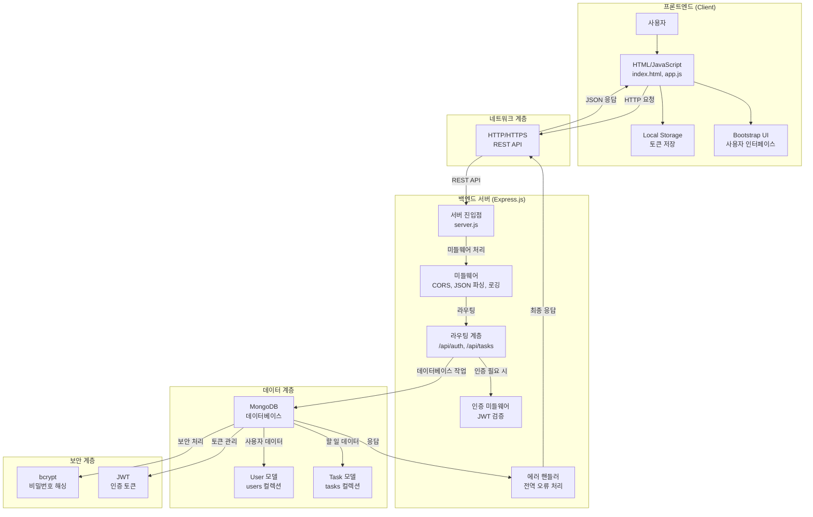
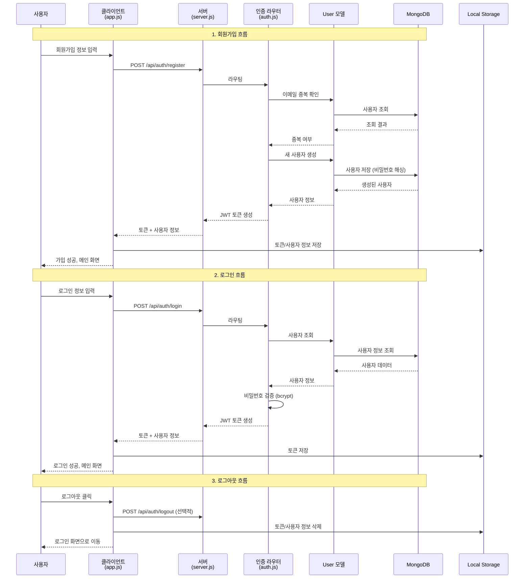
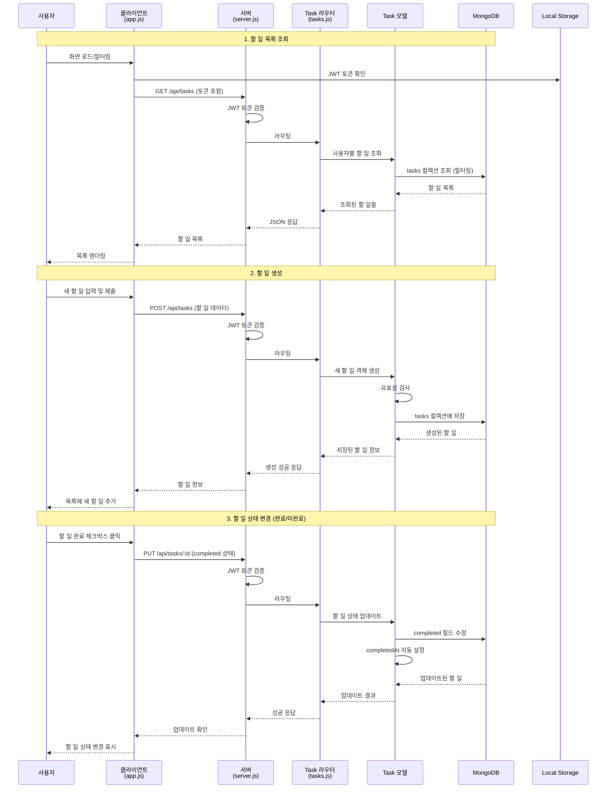
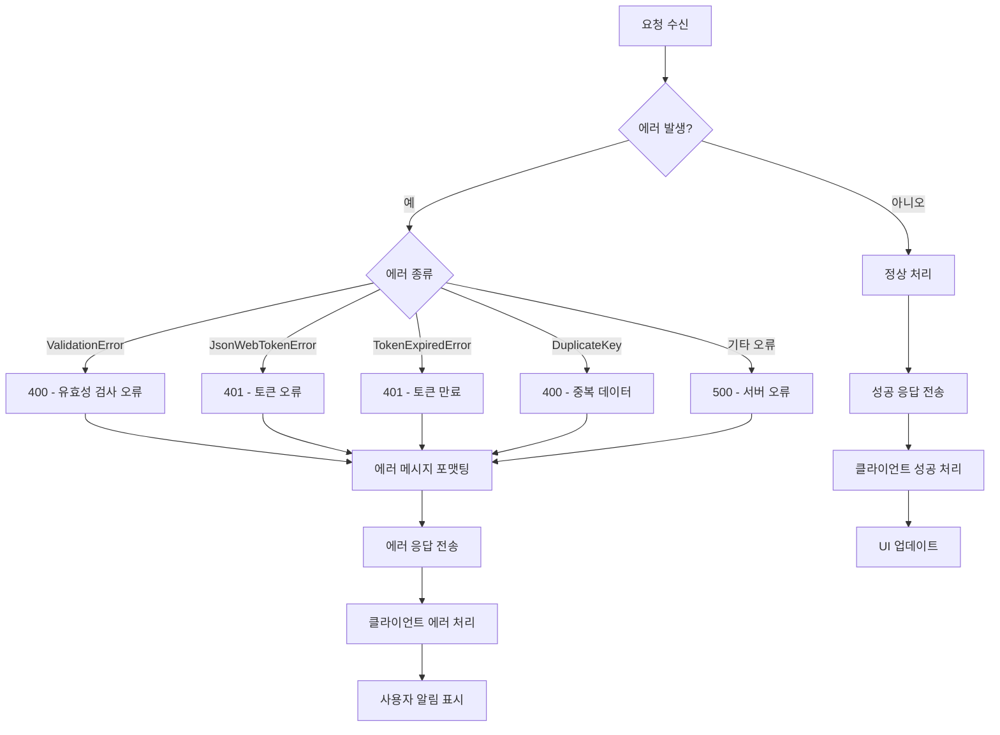

# TaskFlow 시스템 흐름도

## 전체 시스템 아키텍처



## 인증 흐름도



## 할 일 관리 흐름도



## 데이터 모델 관계도

```mermaid
erDiagram
    USER {
        ObjectId _id PK "고유 ID"
        String email UK "이메일 (고유)"
        String password "암호화된 비밀번호"
        String name "사용자 이름"
        String subscription "구독 플랜"
        Boolean isActive "활성화 상태"
        Date createdAt "생성일"
        Date updatedAt "수정일"
    }

    TASK {
        ObjectId _id PK "고유 ID"
        ObjectId userId FK "사용자 ID 참조"
        String title "할 일 제목"
        String description "할 일 설명"
        String category "카테고리"
        Number priority "우선순위 (1-5)"
        Date dueDate "마감일"
        Boolean completed "완료 상태"
        Date completedAt "완료일"
        Array tags "태그 목록"
        Date createdAt "생성일"
        Date updatedAt "수정일"
    }

    USER ||--o{ TASK : "1:N 관계"
    USER :+ userId FK
    TASK :+ userId FK
```

## 상세 API 흐름도

```mermaid
graph TD
    A[클라이언트 요청] --> B{요청 종류}

    B -->|인증 요청| C[/api/auth/*]
    B -->|할 일 요청| D[/api/tasks/*]
    B -->|기타 요청| E[/api/health, /]

    C --> C1[POST /register - 회원가입]
    C --> C2[POST /login - 로그인]
    C --> C3[POST /logout - 로그아웃]
    C --> C4[GET /profile - 프로필]

    C1 --> F[User 모델 → MongoDB]
    C2 --> G[User 모델 → JWT 생성]
    C3 --> H[토큰 무효화]
    C4 --> I[User 모델 조회]

    D --> D1[GET /tasks - 목록 조회]
    D --> D2[POST /tasks - 할 일 생성]
    D --> D3[PUT /tasks/:id - 수정]
    D --> D4[DELETE /tasks/:id - 삭제]
    D --> D5[GET /tasks/stats - 통계]
    D --> D6[DELETE /tasks/completed - 완료된 일 삭제]

    D1 --> J[Task 모델 → 필터링/정렬]
    D2 --> K[Task 모델 → 유효성 검사]
    D3 --> L[Task 모델 → 업데이트]
    D4 --> M[Task 모델 → 삭제]
    D5 --> N[Task 모델 → 집계 통계]
    D6 --> O[Task 모델 → 일괄 삭제]

    F --> P[MongoDB 응답]
    G --> P
    I --> P
    J --> P
    K --> P
    L --> P
    M --> P
    N --> P
    O --> P

    P --> Q[JSON 응답]
    Q --> R[클라이언트 업데이트]
```

## 에러 처리 흐름도

